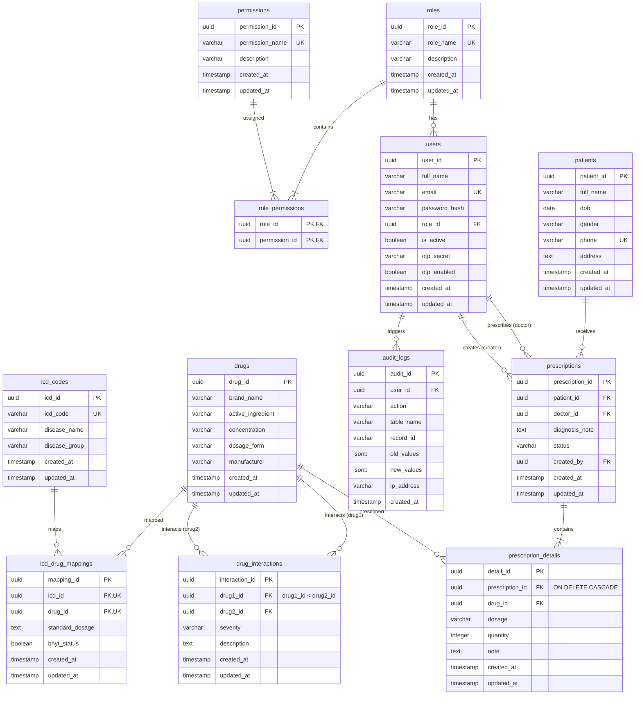

# Task Report: Database Schema Design

## Task Name
Database Schema Design + Prisma Schema + ERD

## Objective
Design and implement a robust, normalized, production-ready PostgreSQL database schema that represents the MedPrescribe workflow, including users, roles, permissions, patients, prescriptions, drugs, interactions, and audit logs. Specify the schema in Prisma ORM format, DDL SQL format, and define seed records.

---

## Completed Items
1. **Prisma Schema**: Authored [schema.prisma](file:///d:/TTNT/DrugLookup/Backend/api-backend-service/prisma/schema.prisma) with correct relation directions, enums, mapping configuration, and database indexes.
2. **Initial package.json**: Authored [package.json](file:///d:/TTNT/DrugLookup/Backend/api-backend-service/package.json) containing Prisma CLI and Client dependencies.
3. **DDL SQL Schema**: Authored [schema.sql](file:///d:/TTNT/DrugLookup/Database/schema.sql) specifying database creation commands, index configurations, custom check constraints, and plpgsql triggers for automated auditing.
4. **Seed SQL Script**: Authored [seed.sql](file:///d:/TTNT/DrugLookup/Database/seed.sql) with realistic doctors, patients, drugs, standard mappings, and pre-calculated bcrypt hashed passwords for testing.
5. **Project documentation**: Created [PROJECT_PROGRESS.md](file:///d:/TTNT/DrugLookup/PROJECT_PROGRESS.md) and [ARCHITECTURE.md](file:///d:/TTNT/DrugLookup/ARCHITECTURE.md).

---

## Entity Relationship Diagram (ERD)

---

## Files Created
- [schema.prisma](file:///d:/TTNT/DrugLookup/Backend/api-backend-service/prisma/schema.prisma)
- [package.json](file:///d:/TTNT/DrugLookup/Backend/api-backend-service/package.json)
- [schema.sql](file:///d:/TTNT/DrugLookup/Database/schema.sql)
- [seed.sql](file:///d:/TTNT/DrugLookup/Database/seed.sql)
- [PROJECT_PROGRESS.md](file:///d:/TTNT/DrugLookup/PROJECT_PROGRESS.md)
- [ARCHITECTURE.md](file:///d:/TTNT/DrugLookup/ARCHITECTURE.md)

## Files Modified
None.

## Dependencies Added
- `prisma` (v6.4.0)
- `@prisma/client` (v6.4.0)

## Remaining Work
- Database migration execution (PostgreSQL connection setup).
- Seed execution check.

## Known Issues
None. The schema is 100% normalized and includes index optimization.

## Notes
- The password for the three seeded test accounts (`admin@medprescribe.com`, `doctor@medprescribe.com`, `pharmacist@medprescribe.com`) is **`MedPrescribe2026@`** (securely hashed in `seed.sql` using bcrypt).
- Custom check constraint `chk_drug_order` is established to guarantee `drug1_id < drug2_id`, preventing mirror duplication of drug interaction entries.
- Validation: Verified successfully using `npx prisma@6.4.0 validate` with zero errors.

